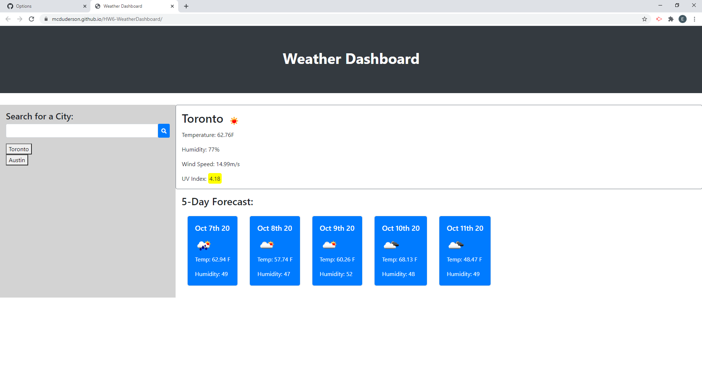

# HW6-WeatherDashboard

## Purpose
A weather dashboard which displays current weather and forecast for a searched city. Users can search for a city, and if found the app will return the current weather, as well as a forecast of the next 5 days. The user's search history is saved as a button for them to quickly check the weather of that city again.

### User Story
AS A traveler
I WANT to see the weather outlook for multiple cities
SO THAT I can plan a trip accordingly

#### Acceptance Criteria
GIVEN a weather dashboard with form inputs
WHEN I search for a city
THEN I am presented with current and future conditions for that city and that city is added to the search history
WHEN I view current weather conditions for that city
THEN I am presented with the city name, the date, an icon representation of weather conditions, the temperature, the humidity, the wind speed, and the UV index
WHEN I view the UV index
THEN I am presented with a color that indicates whether the conditions are favorable, moderate, or severe
WHEN I view future weather conditions for that city
THEN I am presented with a 5-day forecast that displays the date, an icon representation of weather conditions, the temperature, and the humidity
WHEN I click on a city in the search history
THEN I am again presented with current and future conditions for that city
WHEN I open the weather dashboard
THEN I am presented with the last searched city forecast

##### Screen shot of deployed application

##### Links to deployed application and repo.

https://mcduderson.github.io/HW6-WeatherDashboard/

https://github.com/Mcduderson/HW6-WeatherDashboard